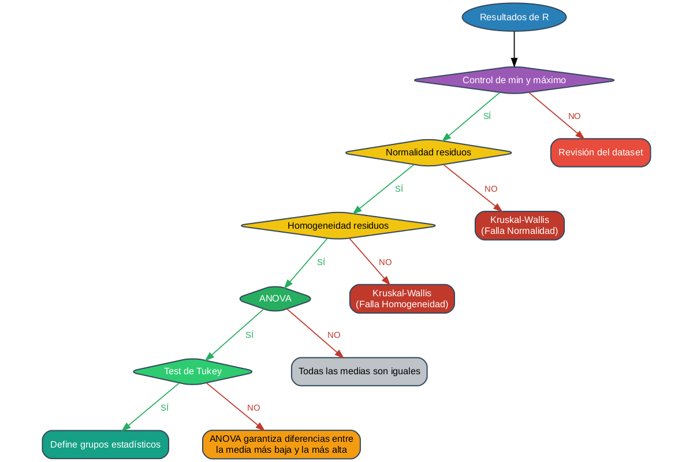

## Decision-Making Process in ANOVA
The ANOVA test is specifically performed to make decisions.  
The decision-making process has a set of sequential steps, in a particular order.  
- Step 01: Control over the response variable.  
- Step 02: Verification of the normality requirement of the residuals.  
- Step 03: Verification of the homogeneity of variances requirement.  
- Step 04: Interpretation of the ANOVA test.  
- Step 05: Interpretation of the Tukey test.  


## Flowchart for ANOVA Analysis
```{r}
#| echo: false
#| warning: false
#| message: false

library(DiagrammeR)
library(DiagrammeRsvg)
library(magrittr)

# Crear y guardar el diagrama como PNG
dot_code <- '
digraph ANOVA_DecisionTree {
    
    graph [
        layout = dot,
        rankdir = TB,
        splines = true,
        bgcolor = "transparent",
        fontname = "Arial",
        ranksep = 0.6,
        nodesep = 0.3
    ] 
    
    node [
        fontname = "Arial",
        fontsize = 12,
        style = "filled, rounded",
        color = "#34495e",
        penwidth = 1.5
    ]
    
    edge [
        fontname = "Arial",
        fontsize = 11,
        penwidth = 1.3
    ]

    // Nodos principales
    A [label = "Resultados de R", shape = oval, fillcolor = "#2980b9", fontcolor = "white"]
    B [label = "Control de min y máximo", shape = diamond, fillcolor = "#9b59b6", fontcolor = "white"]
    C [label = "Normalidad residuos", shape = diamond, fillcolor = "#f1c40f", fontcolor = "black"]
    D [label = "Homogeneidad residuos", shape = diamond, fillcolor = "#f1c40f", fontcolor = "black"]
    E1 [label = "Kruskal-Wallis\\n(Falla Normalidad)", shape = box, fillcolor = "#c0392b", fontcolor = "white"]
    E2 [label = "Kruskal-Wallis\\n(Falla Homogeneidad)", shape = box, fillcolor = "#c0392b", fontcolor = "white"]
    F [label = "ANOVA", shape = diamond, fillcolor = "#27ae60", fontcolor = "white"]
    G [label = "Revisión del dataset", shape = box, fillcolor = "#e74c3c", fontcolor = "white"]
    H [label = "Test de Tukey", shape = diamond, fillcolor = "#2ecc71", fontcolor = "white"]
    I1 [label = "Todas las medias son iguales", shape = box, fillcolor = "#bdc3c7", fontcolor = "black"]
    I2 [label = "Define grupos estadísticos", shape = box, fillcolor = "#16a085", fontcolor = "white"]
    I3 [label = "ANOVA garantiza diferencias entre\\nla media más baja y la más alta", shape = box, fillcolor = "#f39c12", fontcolor = "black"]

    // Conexiones directas
    A -> B
    
    // Desde Control de min y máximo
    B -> C [label = "  SÍ  ", color = "#27ae60", fontcolor = "#27ae60"]
    B -> G [label = "  NO  ", color = "#c0392b", fontcolor = "#c0392b"]
    
    // Desde Normalidad
    C -> D [label = "  SÍ  ", color = "#27ae60", fontcolor = "#27ae60"]
    C -> E1 [label = "  NO  ", color = "#c0392b", fontcolor = "#c0392b"]
    
    // Desde Homogeneidad
    D -> F [label = "  SÍ  ", color = "#27ae60", fontcolor = "#27ae60"]
    D -> E2 [label = "  NO  ", color = "#c0392b", fontcolor = "#c0392b"]
    
    // Desde ANOVA
    F -> H [label = "  SÍ  ", color = "#27ae60", fontcolor = "#27ae60"]
    F -> I1 [label = "  NO  ", color = "#c0392b", fontcolor = "#c0392b"]
    
    // Desde Test de Tukey - DOS flechas
    H -> I2 [label = "  SÍ  ", color = "#27ae60", fontcolor = "#27ae60"]
    H -> I3 [label = "  NO  ", color = "#c0392b", fontcolor = "#c0392b"]

    // Alineación forzada
    {rank = same; A}
    {rank = same; B}
    {rank = same; C; G}
    {rank = same; D; E1}
    {rank = same; F; E2}
    {rank = same; H; I1}
    {rank = same; I2; I3}
    
    // Forzar orden izquierda-derecha
    C -> G [style = invis, weight = 100]
    D -> E1 [style = invis, weight = 100]
    F -> E2 [style = invis, weight = 100]
    H -> I1 [style = invis, weight = 100]
    I2 -> I3 [style = invis, weight = 100]
}
'

# Crear el diagrama
diagram <- grViz(dot_code)

# Guardar como PNG usando DiagrammeRsvg
diagram %>%
  export_svg() %>%
  charToRaw() %>%
  rsvg::rsvg_png("anova_diagram.png", width = 1200, height = 800)

cat("✅ Diagrama guardado como: anova_diagram.png")
```

<div align="center">
<a href="anova_diagram.png" target="_blank" style="text-decoration: none;">

<br>
<small style="color: #666;">🔍 Haz clic en la imagen para ver en tamaño completo</small>
</a>
</div>


## Possible Analysis Cases
Decision-making in One-Way ANOVA involves 5 steps.  
Each step has 2 possibilities: Yes or No.  
This implies that for a given dataset, the analysis can lead to one of 2^5 = 32 possibilities.  
Fortunately, these 32 possibilities can be summarized into 6 analysis cases.    
Any dataset falls into one of these cases, and this implies at least the possibility of providing a general statistical interpretation of what happens to that dataset.  

```{r}
#| echo: false

my_df <- data.frame("Caso" = "",
                    "Control OK" = c("No", "Yes", "Yes", "Yes", "Yes", "Yes"), 
                    "Normalidad not rejected" = c("No/Yes", c("No", "Yes", "Yes", "Yes", "Yes")),
                    "Homogeneidad not rejected" = c("No/Yes", "No/Yes", "No", "Yes", "Yes", "Yes"), 
                    "Anova rejected" = c("No/Yes", "No/Yes", "No/Yes", "No", "Yes", "Yes"), 
                    "Tukey at least 2 groups" = c("No/Yes", "No/Yes", "No/Yes", "No/Yes", "No", "Yes")
)
my_df$"Caso" <- paste0("Case ", 1:nrow(my_df))
my_df$"Decision" <- paste0("LALA", 1:nrow(my_df))
my_df$"Decision"[1] <- "If it is certain that the minimum and/or maximum value do not correspond to possible values of the variable, the possibility of statistical analysis is immediately ruled out until (if possible) a verification of the dataset data is generated. In this context, continuing to interpret statistical values is a serious error since the p-value obtained in ANOVA is not valid."
my_df$"Decision"[2] <- "When the normality requirement of the residuals is not met, the use of the One-Way ANOVA test on the dataset is immediately ruled out. In this context, continuing to interpret statistical values is a serious error since the p-value obtained in ANOVA is not valid. Some other statistical tool should be applied, such as a Mixed General Linear Model, a Generalized Linear Model, a Generalized Mixed Linear Model, or a Kruskal-Wallis test."
my_df$"Decision"[3] <- "When the homogeneity requirement of the residuals is not met, the use of the One-Way ANOVA test on this dataset is immediately ruled out. In this context, continuing to interpret statistical values is a serious error since the p-value obtained in ANOVA is not valid. Some other statistical tool should be applied, such as a Mixed General Linear Model, a Generalized Linear Model, a Generalized Mixed Linear Model, or a Kruskal-Wallis test." 
my_df$"Decision"[4] <- "All requirements are met. It is valid to interpret the ANOVA p-value. The conclusions obtained from ANOVA are valid. The null hypothesis of ANOVA is not rejected. All means are statistically equal. The interpretation of the Tukey test is ruled out. The interpretation of the Tukey test and its statistical groups is subject to the rejection of the ANOVA hypothesis. Regardless of the groups detailed by Tukey or any other multiple comparison test, all means are statistically equal in this case. If the operator needs to make a recommendation, they should recommend any factor level equally. The fact of not rejecting the null hypothesis indicates that the mathematical differences between the means are due only to chance."
my_df$"Decision"[5] <- "All ANOVA requirements are met. It is valid to interpret the ANOVA p-value. The conclusions obtained from ANOVA are valid. The null hypothesis of ANOVA is rejected. There is at least one different mean. The differences between the means are not only due to chance. At this point, ANOVA provides sufficient evidence to say that there are statistically significant differences between the factor level with the highest mean and the factor level with the lowest mean. By rejecting the null hypothesis of ANOVA, it is valid to interpret the Tukey test. In this case, the Tukey test does not distinguish statistical groups even though ANOVA rejected the null hypothesis. ANOVA is a more powerful test than Tukey, therefore it is affirmed that there are differences at least between the factor level with the largest mean and the factor level with the smallest one; and nothing can be said about the rest of the levels. It is a rare case, but it happens. Consider changing the multiple comparison test to another one, if appropriate, with the hope of being able to detect differences between factor levels with a different comparison test than Tukey." 

my_df$"Decision"[6] <- "All ANOVA requirements are met. The conclusions obtained from ANOVA are valid. The null hypothesis of ANOVA is rejected. There is at least one different mean. The differences between the means are not only due to chance. At this point, ANOVA provides sufficient evidence to say that there are statistically significant differences between the factor level with the highest mean and the factor level with the lowest mean. By rejecting the null hypothesis of ANOVA, it is valid to interpret the Tukey test. In this case, the Tukey test distinguishes at least 2 statistical groups. The operator must observe the Tukey table and interpret the groups according to the letters assigned by the Tukey test, taking into account that Tukey can assign multiple letters to each factor level. The operator must make recommendations of factor levels taking into account the statistical framework and the original work framework. It is common to recommend the highest means or the lowest means according to the context of the data.
In the context of Tukey, factor levels that share at least 1 letter are statistically equal. It takes some time to get used to correctly interpreting the Tukey table. There are also other contexts where the lowest or highest means are not necessarily sought, such as specifically looking for which factor levels are statistically equal to a particular level. The Tukey test can also be applied in this context." 

library(knitr)
library(kableExtra)

# Mostrar con kable controlando anchos
kable(my_df, format = "html", caption = "Resumen de Casos Posibles en ANOVA") %>%
  kable_styling(
    bootstrap_options = c("striped", "hover", "condensed"), 
    full_width = FALSE,
    font_size = 12
  ) %>%
  column_spec(1, width = "8%") %>%    # Caso
  column_spec(2, width = "8%") %>%    # Control OK
  column_spec(3, width = "10%") %>%   # Normalidad
  column_spec(4, width = "12%") %>%   # Homogeneidad
  column_spec(5, width = "10%") %>%   # ANOVA
  column_spec(6, width = "12%") %>%   # Tukey
  column_spec(7, width = "40%")       # Decisión (más ancha)
```

